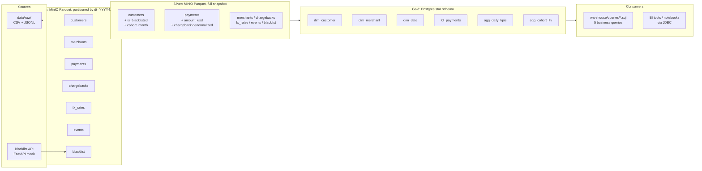
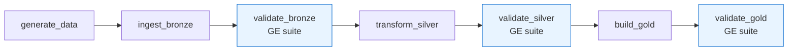
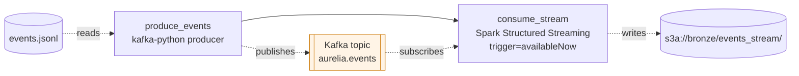
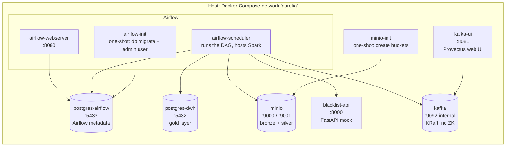
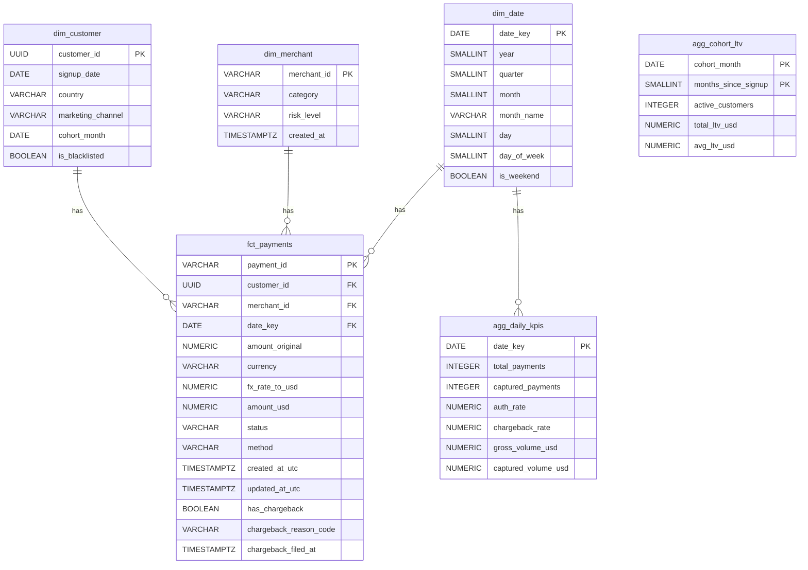

# Architecture

## Medallion overview

The pipeline follows the standard **medallion** pattern: three named
layers, each with a well-defined contract.

### Layer contracts

| Layer  | Storage             | Format         | Partition          | Contract                                                                 |
| ------ | ------------------- | -------------- | ------------------ | ------------------------------------------------------------------------ |
| Bronze | MinIO (S3)          | Parquet        | `dt=YYYY-MM-DD/`   | Raw data as ingested, no semantic changes. Adds `_ingested_at`.          |
| Silver | MinIO (S3)          | Parquet        | none (snapshot)    | Casts, UTC timestamps, FK integrity, FX priced in USD, denormalized CBs. |
| Gold   | Postgres 15         | Tables (star)  | none (small)       | Analytics-ready. FKs enforced. Aggregates pre-computed.                  |

## The DAGs

Two DAGs coexist. The batch one is the main flow; the streaming one
is an independent add-on demonstrating the event-driven pattern.

### `aurelia_daily` — batch

- **Schedule**: `@daily`, `catchup=False`, `max_active_runs=1`.
- **Retries**: 1 per task, 1 min backoff, 30 min execution timeout.
- **Idempotency**: each task can be re-run safely — bronze pisa the
  `dt=` partition, silver is a full snapshot rewrite, gold does
  DELETE-reverse-FK + INSERT-forward-FK.

Each validate task is a Great Expectations suite that raises on
failure, breaking the chain and preventing downstream layers from
being materialized on bad data.

### `aurelia_streaming` — Kafka + Structured Streaming

- **Schedule**: `*/5 * * * *` (every 5 minutes), `catchup=False`,
  `max_active_runs=1`.
- **Producer** emits at 20 ms/message so the flow is visible in
  Kafka-UI (~40 s per micro-batch of 2000 events).
- **Consumer** uses `trigger=availableNow` and persists its offsets
  in a Spark checkpoint on a docker volume (not on S3, to avoid
  atomic-rename quirks of S3A with Structured Streaming).
- **Silver `_read_bronze_events_unioned`** joins the batch source
  (`bronze/events/dt=<ds>/`) with the streaming source
  (`bronze/events_stream/`) and dedupes on `event_id` — so if the
  streaming DAG never runs, silver still works from batch alone.

Evidence — the topic being fed by the producer, and the Parquet files
landed by the streaming consumer:

## Services (docker-compose)

| Service            | Image                              | Role                                                    |
| ------------------ | ---------------------------------- | ------------------------------------------------------- |
| `postgres-dwh`     | `postgres:15-alpine`               | Gold warehouse. Loads `warehouse/ddl/*.sql` on first boot |
| `postgres-airflow` | `postgres:15-alpine`               | Airflow metadata (LocalExecutor requires it)              |
| `minio`            | `minio/minio`                      | S3-compatible object storage for bronze/silver            |
| `minio-init`       | `minio/mc`                         | Creates `bronze` / `silver` / `gold` buckets and exits    |
| `blacklist-api`    | `python:3.11-slim` + FastAPI       | Serves `/v1/blacklist` from `data/raw/blacklist.json`     |
| `airflow-init`     | `aurelia/airflow:local` (custom)   | Runs `airflow db migrate` and creates admin user          |
| `airflow-webserver`| `aurelia/airflow:local` (custom)   | UI on `:8080`                                             |
| `airflow-scheduler`| `aurelia/airflow:local` (custom)   | Runs the DAGs. Also hosts Spark in `local[*]` mode        |
| `kafka`            | `apache/kafka:3.7.2`               | Single-node broker in KRaft mode (no Zookeeper)           |
| `kafka-ui`         | `provectuslabs/kafka-ui`           | Web UI for the Kafka broker on `:8081`                    |

Custom Airflow image = official `apache/airflow:2.9.3-python3.11` +
Java (JRE for PySpark) + `pyspark`, `great-expectations`, `minio`,
`httpx`, `psycopg2-binary`, `pytest`, `fastapi`.

### Bucket lifecycle

The three MinIO buckets (`bronze`, `silver`, `gold`) are created on
first boot by the `minio-init` shell container in docker-compose so
the stack works with zero external tooling. The same buckets are also
declared in [`terraform/`](terraform/) using the `aminueza/minio`
provider — running `terraform apply` reconciles them idempotently.
Both paths coexist; pick whichever you prefer.

## Gold data model (star schema)

- **Grain of `fct_payments`**: one row per payment.
- **Grain of `agg_daily_kpis`**: one row per calendar day.
- **Grain of `agg_cohort_ltv`**: one row per `(cohort_month, months_since_signup)`.

Chargeback attributes are **denormalized** onto `fct_payments`
(`has_chargeback`, `chargeback_reason_code`, `chargeback_filed_at`) to
avoid joins in downstream queries. There is no `fct_chargebacks` fact
table on purpose.

## Data quality

Three Great Expectations suites, one per medallion layer, all
targeting the `payments` table (the fact of the whole platform).
Total: **26 expectations**.

| Suite               | Checks                                                                                              |
| ------------------- | --------------------------------------------------------------------------------------------------- |
| `bronze_payments`   | PK not null + unique, FK columns not null, `currency` / `status` / `method` in domain, `amount > 0` |
| `silver_payments`   | PK not null + unique, FKs not null, `created_at_utc` parsed, `amount_usd` / `fx_rate_to_usd` > 0    |
| `gold_fct_payments` | PK not null + unique, FKs not null, `date_key` not null, `status` in domain, `amount_usd > 0`       |

If any expectation fails, the corresponding `validate_*` task raises
and the downstream layers do not run — the pipeline stops on bad data.

## Idempotency and reproducibility

Both properties are enforced at every layer of the pipeline:

| Guarantee            | How it's achieved                                                                                                        |
| -------------------- | ------------------------------------------------------------------------------------------------------------------------ |
| Same input, same output | `random.seed(42)` in `generate_data.py`. UUIDs built from `random.getrandbits` (not `uuid.uuid4()`, which uses `os.urandom`). |
| Re-run of a partition   | Bronze writes to `dt=<ds>/` with `mode=overwrite` → the partition is pisada, siblings untouched.                          |
| Full refresh of gold    | `DELETE` in reverse-FK order + `INSERT` in forward-FK order. DDL, indexes and constraints untouched.                      |
| DDL applied once        | `warehouse/ddl/*.sql` mounted into `/docker-entrypoint-initdb.d/` — Postgres runs it on first boot only.                  |
| Env-driven config       | Every service reads its config from env vars with `${VAR:-default}` fallback, so the stack works without `.env`.          |
