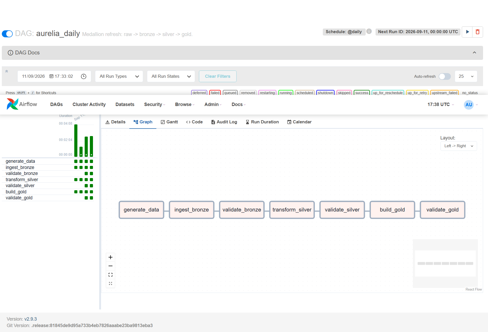
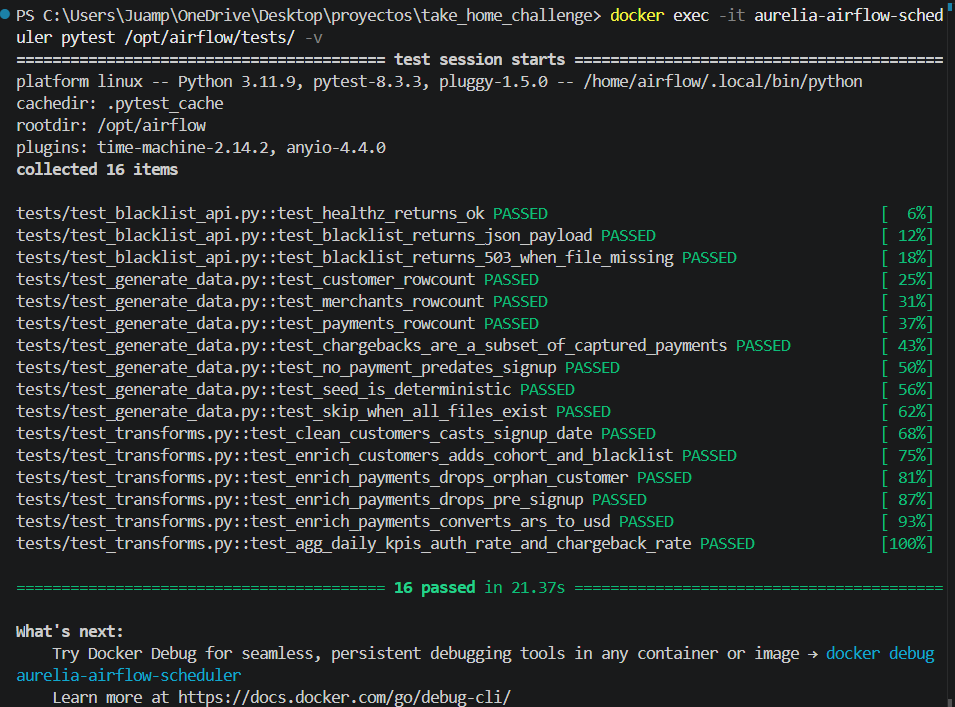
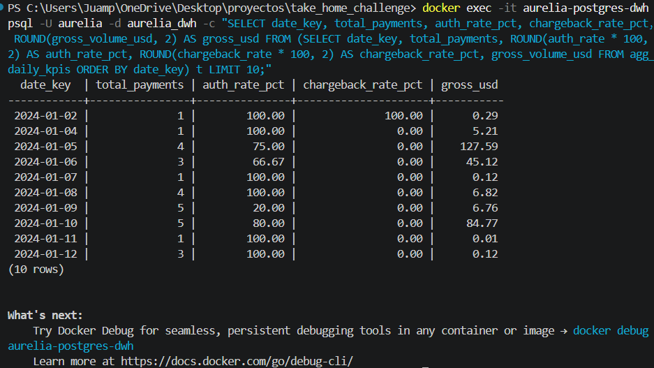
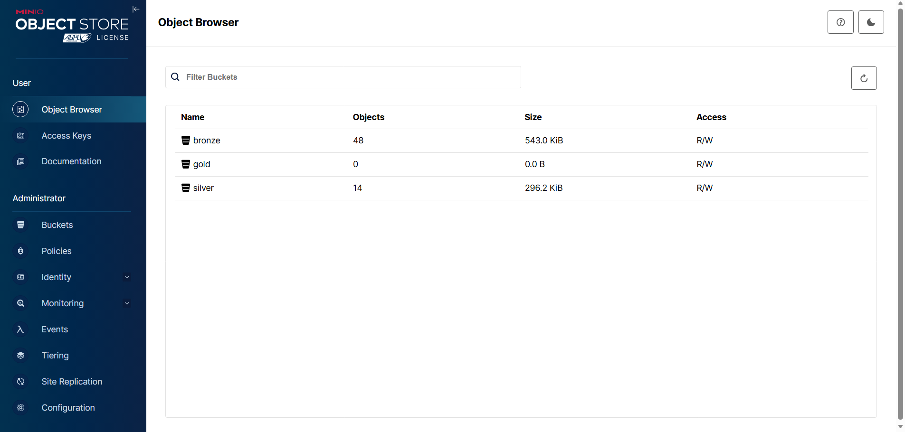
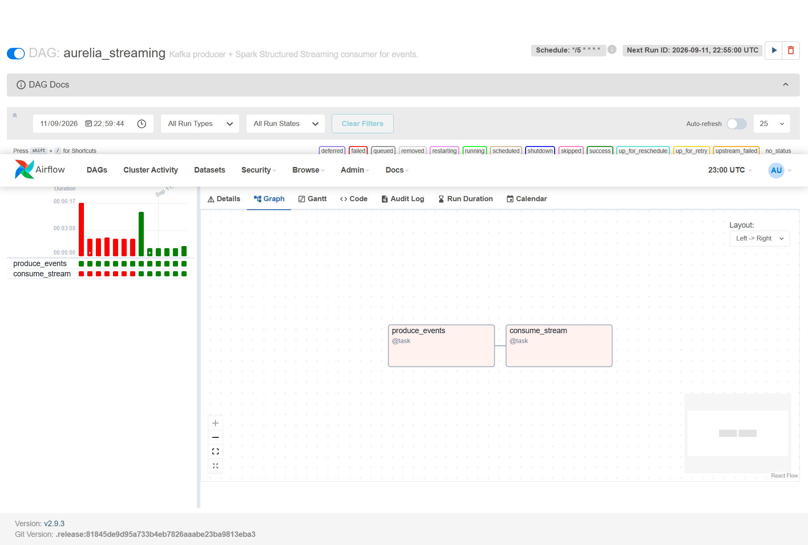
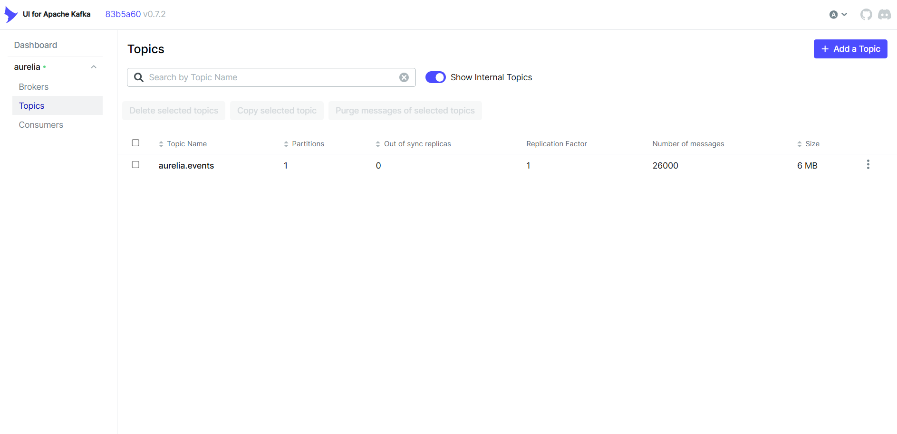
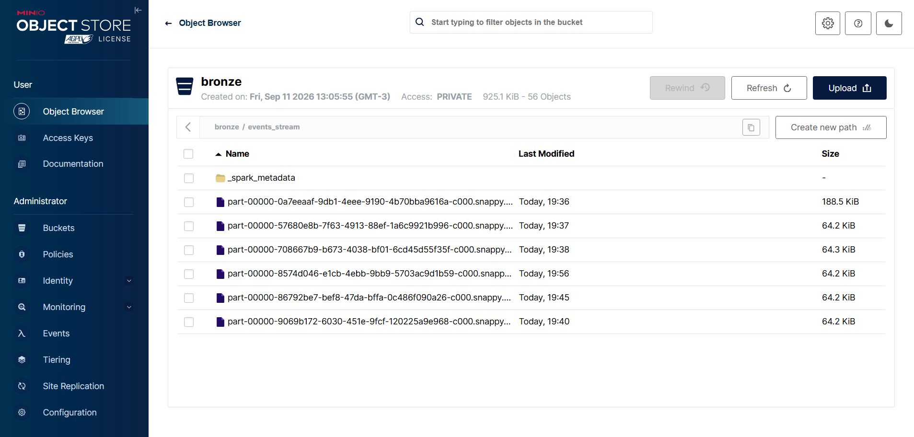

# Aurelia Data Platform

> Batch data pipeline for **Aurelia**, a real-time payments fintech,
> converting raw payment events into reliable business metrics
> (authorization rate, chargeback rate, cohort LTV, fraud signals)
> using the medallion architecture (bronze / silver / gold).


*Airflow DAG `aurelia_daily` — 7 tasks, 4 successful runs.*

## Features

The pipeline delivers:

- **Deterministic seed** of 7 synthetic raw datasets (customers,
  merchants, payments, chargebacks, FX rates, events, blacklist) with
  a fixed random seed — same bytes on every run, cross-machine.
- **Bronze layer** in MinIO as Parquet, partitioned by `dt=YYYY-MM-DD`
  so re-runs pisan the partition (idempotent).
- **Silver layer** in MinIO with type-casted UTC timestamps, foreign
  key integrity, FX conversion to USD, blacklist join and chargeback
  denormalization onto payments.
- **Gold layer** in Postgres as a star schema
  (`dim_customer`, `dim_merchant`, `dim_date`, `fct_payments`,
  `agg_daily_kpis`, `agg_cohort_ltv`) rebuilt via DELETE-reverse-FK +
  INSERT-forward-FK (idempotent, DDL untouched).
- **Great Expectations** suites on every layer of `payments` (26
  expectations total). Failures block the DAG.
- **5 business SQL queries** in [`warehouse/queries/`](warehouse/queries/)
  answering concrete questions (auth rate, chargeback rate by merchant,
  cohort LTV, high-risk merchants, fraud signals).
- **16 pytest tests** covering the seed generator, Spark
  transformations, and the FastAPI mock.
- **FastAPI mock** of the external `/v1/blacklist` endpoint consumed
  by the bronze layer.
- **Kafka streaming track** (parallel to the batch path) — a Python
  producer publishes events to a Kafka topic and Spark Structured
  Streaming lands them under `s3a://bronze/events_stream/`. Silver
  unions the batch and streaming events and dedupes on `event_id`.
- Everything **dockerized** — one command spins up the whole stack
  (Airflow, Postgres, MinIO, blacklist API, Kafka, Kafka-UI).

## Prerequisites

- **Docker Desktop** (Windows or macOS) with WSL 2 enabled on Windows.
- Free ports on the host: `5432`, `5433`, `8000`, `8080`, `8081`, `9000`, `9001`.
- ~6 GB of RAM available for the Docker VM.
- No local Python or Java install required — everything runs in
  containers.

## How to run the app

```bash
# One-time: copy the example env file.
cp .env.example .env

# Bring the whole stack up (first run: ~5-8 min to build the Airflow image).
docker compose up -d --build
```

Once every service is healthy (`docker compose ps` shows all
`healthy`), open:

- **Airflow UI**: <http://localhost:8080> (login `admin` / `admin`)
- **MinIO Console**: <http://localhost:9001> (login `minioadmin` / `minioadmin`)
- **Kafka-UI**: <http://localhost:8081> (no auth)
- **Blacklist API docs**: <http://localhost:8000/docs>

To trigger a pipeline run:

1. Open the Airflow UI.
2. Un-pause the `aurelia_daily` DAG (toggle top-left of its row).
3. Click the ▶ Trigger button on the right.
4. Watch the graph turn green in ~4 minutes.

Alternatively, run the pipeline end-to-end from the CLI without
touching Airflow:

```bash
docker exec -it aurelia-airflow-scheduler \
    python /opt/airflow/scripts/run_pipeline.py --ds 2024-03-15
```

## How to run the tests

```bash
docker exec -it aurelia-airflow-scheduler pytest /opt/airflow/tests/ -v
```

Expected output:



## How to run the business SQL queries

```powershell
# PowerShell (Windows)
Get-Content warehouse/queries/auth_rate_daily.sql `
    | docker exec -i aurelia-postgres-dwh psql -U aurelia -d aurelia_dwh
```

```bash
# bash / zsh (macOS, Linux, Git Bash)
docker exec -i aurelia-postgres-dwh psql -U aurelia -d aurelia_dwh \
    < warehouse/queries/auth_rate_daily.sql
```

Sample output (first days of the period — activity ramps up as more
customers sign up over time):



## Repository layout

```
.
├── airflow/
│   ├── Dockerfile              custom Airflow image (Java + PySpark + GE)
│   ├── requirements.txt        runtime deps + test deps (pytest, fastapi, kafka)
│   └── dags/
│       ├── aurelia_daily.py    batch pipeline (bronze -> silver -> gold)
│       └── aurelia_streaming.py Kafka producer + Spark Structured Streaming
├── spark/
│   ├── common/                 SparkSession builder, IO, schemas
│   └── jobs/
│       ├── bronze_ingest.py    raw -> s3a://bronze/<t>/dt=<ds>/
│       ├── silver_clean.py     bronze -> s3a://silver/<t>/
│       ├── gold_marts.py       silver -> Postgres (star schema)
│       └── stream_events.py    Kafka -> s3a://bronze/events_stream/
├── expectations/
│   ├── suites.py               26 GE expectations for payments
│   └── runner.py               EphemeralDataContext runner (raises on fail)
├── warehouse/
│   ├── ddl/001_init.sql        gold schema (loaded by Postgres on first boot)
│   └── queries/                5 business SQL queries
├── blacklist_api/              FastAPI mock of /v1/blacklist
├── scripts/
│   ├── generate_data.py        deterministic seed (stdlib only)
│   ├── produce_events.py       Kafka producer for the streaming DAG
│   └── run_pipeline.py         CLI to run the batch pipeline without Airflow
├── tests/                      16 pytest tests
├── data/raw/                   generated CSVs / JSONL / JSON
├── terraform/                  IaC for the MinIO buckets (optional path)
├── docker-compose.yml          10 services (dwh, airflow-metadata, minio,
│                               minio-init, blacklist-api, kafka, kafka-ui,
│                               airflow-init, airflow-webserver, airflow-scheduler)
└── docs/screenshots/           images referenced by this README
```

See [ARCHITECTURE.md](ARCHITECTURE.md) for the diagram of the data flow.

## Storage layers

After a successful run, the MinIO console shows the bronze and silver
buckets populated with Parquet. Gold is deliberately empty in MinIO
because it materializes to Postgres.



## Decisions and trade-offs

- **PySpark over dbt.** PySpark handles both reading from S3-compatible
  object storage (bronze/silver Parquet) and writing to Postgres
  (gold) in a single tool, whereas dbt would still need a separate
  ingestion layer.
- **Spark in `local[*]` mode inside the Airflow scheduler container**
  rather than a dedicated Spark cluster. Cuts RAM footprint from
  ~4-6 GB (standalone master + worker) down to ~1-2 GB. For the
  volumes this project handles (~5 k payments) it's more than enough.
- **Single `ingest_bronze` task** instead of 7 parallel per-table
  tasks. Each PythonOperator boots its own Spark JVM; 7 parallel
  JVMs would OOM a laptop-sized container. Sequential ingestion of
  the 7 datasets inside a single Spark session takes <15 s — the
  visualization loss is not worth the memory risk.
- **No ORM / Alembic.** The gold schema is owned by the pipeline and
  materialized by Spark JDBC. Alembic would add a second source of
  truth and complexity with no benefit. `warehouse/ddl/001_init.sql`
  is versioned SQL and Postgres loads it on first boot via
  `docker-entrypoint-initdb.d`.
- **`DELETE` in reverse-FK order + `INSERT` in forward-FK order** for
  gold refreshes, instead of `TRUNCATE`. `TRUNCATE` on tables
  referenced by FKs requires `CASCADE`, which would also truncate the
  child rows and complicate the load order. `DELETE` is idempotent,
  leaves the DDL untouched, and works with any subset of tables.
- **`stringtype=unspecified` in the JDBC URL.** Spark sends every
  string as `character varying`, and Postgres refuses to implicit-cast
  into UUID / DATE / TIMESTAMPTZ. This option lets Postgres infer the
  target column type. Standard workaround for Spark-JDBC-to-Postgres
  when the DDL has non-string types.
- **Great Expectations with `EphemeralDataContext`.** No
  `great_expectations.yml`, no filesystem stores, no data-docs site.
  Suites live in code (`expectations/suites.py`) so they're diff-able
  and testable. The runner raises on failure, which surfaces as a red
  Airflow task and blocks the downstream layers.
- **Tests run inside the Airflow container.** Adds pytest + fastapi
  to `airflow/requirements.txt` so there's a single Python environment
  to reason about. Tests use a session-scoped `SparkSession` fixture
  (`local[1]`, `shuffle=1`) for speed and deterministic ordering.

## Areas to improve / future work

- **`fct_events` in gold.** Events (login / failed_pin /
  password_reset) are cleaned in silver but not materialized in gold.
  Adding them would let `fraud_signals.sql` combine an "authentication
  anomalies" signal (e.g. customers with many `failed_pin` events).
- **CI (GitHub Actions).** Run the pytest suite on every push. The
  scaffolding is trivial — a matrix on Python 3.11 with `pip install
  -r airflow/requirements.txt && pytest tests/`.
- **Data-docs from Great Expectations.** Currently the suites raise
  on failure but don't produce an HTML report. Wiring the checkpoint
  API + a file store would give a browseable data-quality dashboard.
- **Partitioning of `fct_payments` in Postgres.** For higher volumes
  the fact table would benefit from `PARTITION BY RANGE (date_key)`.

## Streaming track (Kafka)

The `aurelia_streaming` DAG runs every 5 minutes and demonstrates the
event-driven side of the platform:


*Airflow DAG `aurelia_streaming` — two tasks (`produce_events` → `consume_stream`), scheduled `*/5 * * * *`.*

1. **`produce_events`** — reads `data/raw/events.jsonl` and publishes
   each event to the Kafka topic `aurelia.events` with a 20 ms delay
   between messages (so the flow is visible in Kafka-UI). Uses
   `customer_id` as the message key.
2. **`consume_stream`** — Spark Structured Streaming with
   `trigger=availableNow`. Reads the topic from the last committed
   offset (checkpoint on a docker volume) and writes new messages as
   Parquet under `s3a://bronze/events_stream/`.

Messages piling up in the Kafka topic after a few DAG runs, visible in
Kafka-UI:


*Topic `aurelia.events` — 26 000 messages, 6 MB (13 runs of the producer × 2 000 events).*

And the Parquet part-files landed by Structured Streaming under
`s3a://bronze/events_stream/`, one file per micro-batch:


*`bronze/events_stream/` — 56 objects, ~925 KiB. Each `part-00000-…snappy.parquet` corresponds to one Spark micro-batch; `_spark_metadata/` is the Structured Streaming commit log.*

The batch DAG `aurelia_daily` continues to ingest the same file into
`s3a://bronze/events/dt=<ds>/`. Silver unions both sources and dedupes
on `event_id`, so the two paths coexist without conflict — a
convenient demo of "batch and streaming from the same source of truth".

Open <http://localhost:8081> to see messages arriving in the topic.

## Infrastructure as Code

The MinIO buckets can be managed declaratively with Terraform instead
of the `minio-init` shell container in compose. Both paths are
idempotent and produce the same three buckets.

```bash
cd terraform
terraform init
terraform plan
terraform apply
```

See [`terraform/README.md`](terraform/README.md) for the Docker-based
workflow (no local Terraform install required) and how to add new
buckets. State is local (`terraform.tfstate`) and gitignored — no
remote backend is wired since this is a local development stack.

## Env vars

See [`.env.example`](.env.example). All variables have sensible
defaults so the stack works without a `.env` file, but production-like
deployments should override the credentials.

## Techs

- Python 3.11
- Apache Airflow 2.9.3 (LocalExecutor + Postgres metadata)
- PySpark 3.5.1 (`local[*]` mode)
- Great Expectations 0.18.19
- PostgreSQL 15 (gold DWH + Airflow metadata, separate instances)
- MinIO (S3-compatible object storage for bronze / silver)
- FastAPI 0.115 + Uvicorn (blacklist mock)
- pytest 8.3.3
- Docker Compose
- Terraform 1.5+ (optional — declarative management of the MinIO buckets)
- Apache Kafka 3.7.2 (official ASF image, KRaft mode, no Zookeeper) + Kafka-UI (Provectus)
- `kafka-python` 2.0.2 (producer) + Spark `spark-sql-kafka-0-10_2.12:3.5.1` (consumer)

## Endpoints once the stack is up

| Service          | URL                             | Credentials                   |
| ---------------- | ------------------------------- | ----------------------------- |
| Airflow UI       | <http://localhost:8080>         | `admin` / `admin`             |
| MinIO Console    | <http://localhost:9001>         | `minioadmin` / `minioadmin`   |
| Kafka-UI         | <http://localhost:8081>         | —                             |
| Blacklist API    | <http://localhost:8000/docs>    | —                             |
| Postgres DWH     | `localhost:5432/aurelia_dwh`    | `aurelia` / `aurelia`         |
| Postgres Airflow | `localhost:5433/airflow`        | `airflow` / `airflow`         |
